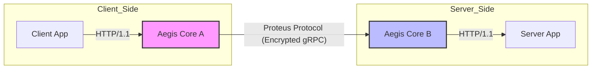

# Aegis Core


**Aegis Core** is a paradigm shift in API security. Unlike traditional WAFs that react to known threats, Aegis Core implements **Moving Target Defense (MTD)** and **Cyber Deception** to make your API infrastructure invisible and unpredictable to attackers.

By deploying as a transparent "man-in-the-middle" gateway, it dynamically encrypts endpoints, obfuscates traffic, and actively misleads scanners, all without requiring a single line of code change in your protected applications.

---

## 🛡️ Core Philosophy

### 1. Moving Target Defense
Traditional APIs are static targets. Attackers have unlimited time to scan, probe, and reverse-engineer your endpoints (e.g., `/api/v1/login`). Aegis Core eliminates this advantage by **dynamically rotating endpoint paths** and encrypting payloads. A valid request URL changes with every session, rendering automated scanners and replay attacks useless.

### 2. Cyber Deception & Camouflage
The system actively lies to unauthorized observers.
*   **Protocol Camouflage:** A successful `200 OK` response carrying sensitive data can be wrapped in a fake `503 Service Unavailable` or `404 Not Found` envelope.
*   **Traffic Obfuscation:** Traffic analysis tools see only uniform, encrypted binary streams (Protobuf over gRPC) with misleading metadata, making it nearly impossible to distinguish between a login attempt and a heartbeat signal.

---

## 🏗️ Architecture

The system operates as a pair of proxies protecting the channel between a Client Application and a Server Application.



*   **Aegis Core A (Encryptor):** Sits next to the client. It intercepts standard HTTP requests, performs an **ECDH key exchange** with Core B, and wraps the request in the secure **Proteus Protocol**.
*   **Aegis Core B (Decryptor):** Sits next to the server. It decrypts the traffic, enforces strict Zero-Trust policies (WAF, Schema Validation), and forwards the clean request to your backend.

---

## 🚀 Key Features

### 🔒 Cryptographic Core
*   **AES-256-GCM:** All payloads are authenticated and encrypted.
*   **ECDH Key Exchange:** Ephemeral session keys are generated for every connection; no master keys are ever transmitted.
*   **HMAC Signatures:** Ensures integrity for every packet.

### 🛡️ Zero-Trust Security Modules (Core B)
Before any request reaches your server, it must pass a multi-layered filter:
1.  **Schema Validation:** Validates the decrypted request against your **OpenAPI 3.x** specification. If the request doesn't match the schema, it is rejected immediately.
2.  **Web Application Firewall (WAF):** Scans for SQL Injection, XSS, and Command Injection patterns.
3.  **Rate Limiting:** Redis-backed rate limiter prevents Brute Force and DoS attacks.

---

## ⚙️ Configuration

Aegis Core is configured entirely via environment variables.

| Variable | Description | Default |
| :--- | :--- | :--- |
| **Common** | | |
| `LOG_LEVEL` | Logging verbosity (DEBUG, INFO, ERROR) | `INFO` |
| **Core A (Client)** | | |
| `CORE_A_HOST` | Host to bind the HTTP proxy | `0.0.0.0` |
| `CORE_A_PORT` | Port for the HTTP proxy | `8000` |
| `CORE_B_GRPC_TARGET`| Address of the remote Core B | `localhost:50051` |
| `CORE_B_HTTP_URL` | Address of Core B HTTP server for key exchange | `http://localhost:8001` |
| **Core B (Server)** | | |
| `CORE_B_GRPC_PORT` | Port to bind the gRPC listener | `50051` |
| `TARGET_APP_URL` | The real backend URL to protect | `http://localhost:8080` |
| `REDIS_URL` | Redis connection string for Rate Limiting | `redis://localhost:6379` |

---

## ⚡ Quick Start

### Prerequisites
*   Python 3.10+
*   Poetry
*   Redis (optional, for Rate Limiting features)

### Installation

```bash
# 1. Clone the repository
git clone <repository_url>
cd aegis-core

# 2. Install dependencies
poetry install
```

### Running the System

**1. Start Aegis Core B (Server-side):**
```bash
export TARGET_APP_URL="http://your-backend-service:8080"
poetry run python -m aegis_core.core_b
```

**2. Start Aegis Core A (Client-side):**
```bash
export CORE_B_GRPC_TARGET="localhost:50051"
poetry run python -m aegis_core.core_a
```

Now, point your client application to `http://localhost:8000` instead of the real backend.

---

## 🧪 Testing

The project is covered by a suite of unit tests that verify the **Cryptographic Engine** (encryption, decryption, key exchange) and the **Platform Logic** (request handling, protocol wrapping).

To run the tests:
```bash
poetry run pytest
```

> **Important Note:** While the platform components are rigorously tested in isolation, a full end-to-end integration test (Client -> Core A -> Core B -> Server) was not performed for this release. The system is verified at the component and unit level.

---

## 📄 License & Contact

This project is licensed under the **MIT License**. See the [LICENSE](LICENSE) file for details.

**Contact:**
Telegram: [@Lotargo](https://t.me/Lotargo)
Copyright (c) 2025 Lotargo
