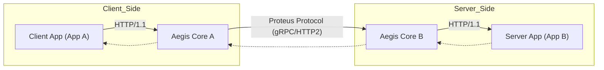

# Aegis Core Architecture

## Overview

Aegis Core is a proactive security gateway designed to protect API interactions between client and server applications. It operates as a pair of proxies, implementing "Moving Target Defense" and "Cyber Deception" principles to mask the true nature of the API infrastructure.

## System Components

The system consists of two main components acting as a transparent "man-in-the-middle" proxy gateway:

*   **Aegis Core A (Encryptor Proxy):** Deployed on the client side. Intercepts outgoing HTTP requests, encrypts, and obfuscates them before transmitting over the secure channel.
*   **Aegis Core B (Decryptor Proxy):** Deployed on the server side. Receives obfuscated requests, decrypts, validates, and forwards them to the target application.

## Data Flow

The traffic flows transparently from the Client Application (App A) through the Aegis proxies to the Server Application (App B) and back.

## Proteus Protocol

The communication between Core A and Core B uses the custom **Proteus Protocol**, built on top of gRPC and Protocol Buffers. This protocol ensures confidentiality, integrity, and obfuscation.

### Key Features

1.  **Session Encryption:** Uses **AES-256-GCM** for authenticated encryption of the payload.
2.  **Key Exchange:** secure **ECDH (Elliptic-curve Diffie–Hellman)** key exchange to generate ephemeral session keys.
3.  **Endpoint Obfuscation:** The actual API endpoints (e.g., `/api/users`) are masked into dynamic, encrypted paths.
4.  **Protocol Camouflage:** Responses can be camouflaged. A successful `200 OK` response might be wrapped in a `503 Service Unavailable` envelope to mislead traffic analyzers.

### Request Structure (AegisRequest)

*   `encrypted_endpoint`: The encrypted URL path.
*   `encrypted_payload`: The encrypted body of the request.
*   `metadata`: Headers and other meta-information.
*   `signature`: HMAC signature for integrity verification.

### Response Structure (AegisResponse)

*   `fake_http_status`: Camouflaged HTTP status code.
*   `encrypted_payload`: The actual encrypted response (containing real status and body).
*   `rotor_sync_position`: Position for the internal state synchronization ("rotor").
*   `signature`: HMAC signature.

## Security Modules (Core B)

Aegis Core B acts as the gatekeeper and implements a multi-layered Zero-Trust filter:

1.  **Web Application Firewall (WAF):** Analyzes decrypted payloads for SQLi, XSS, and Command Injection patterns.
2.  **Rate Limiter:** Limits request rates based on client ID (IP or API key) using Redis.
3.  **Schema Validation:** Validates decrypted requests against a defined OpenAPI 3.x specification. Invalid requests are rejected before reaching the target application.

## Technology Stack

*   **Core:** Python 3.10+, FastAPI (ASGI)
*   **Transport:** gRPC, Protocol Buffers
*   **Cryptography:** `cryptography` library (AES-GCM, ECDH, HMAC-SHA256)
*   **Infrastructure:** Docker, Kubernetes
*   **Logging:** ELK Stack (Elasticsearch, Logstash, Kibana)
